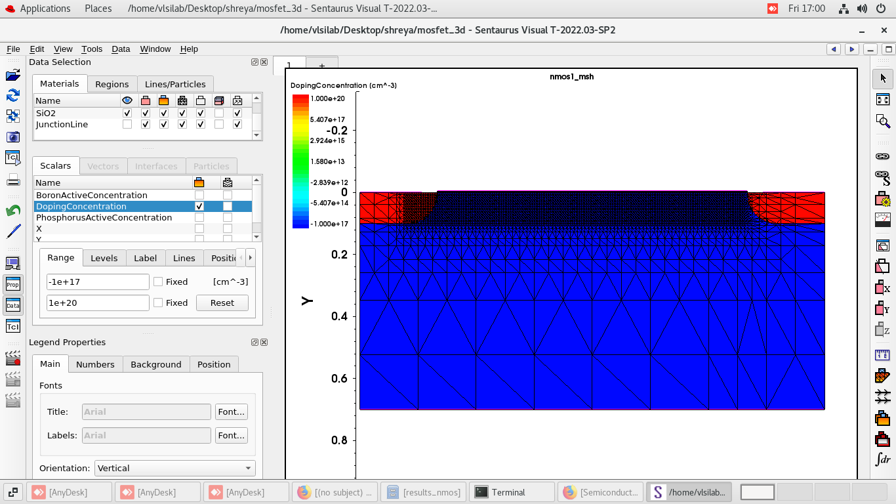
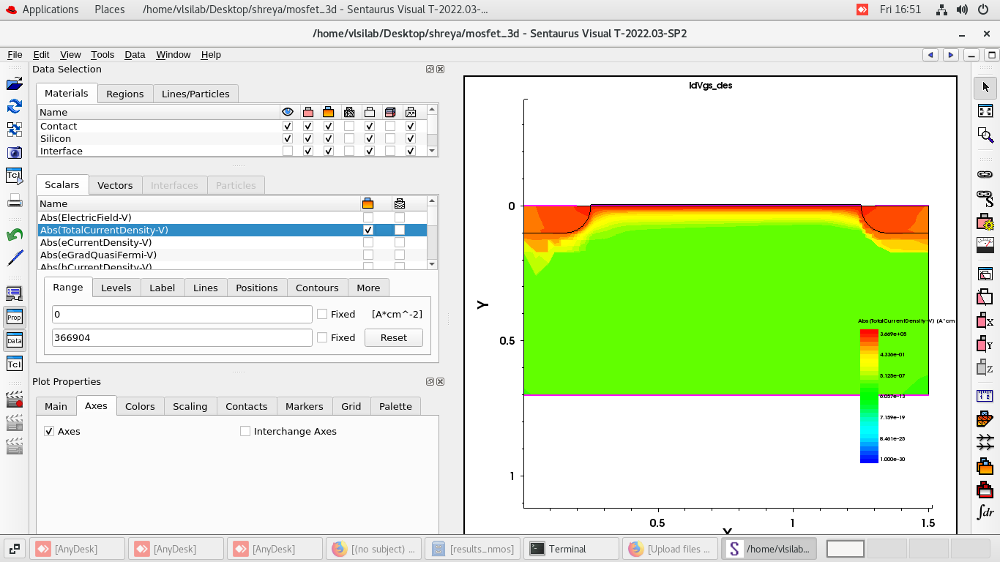
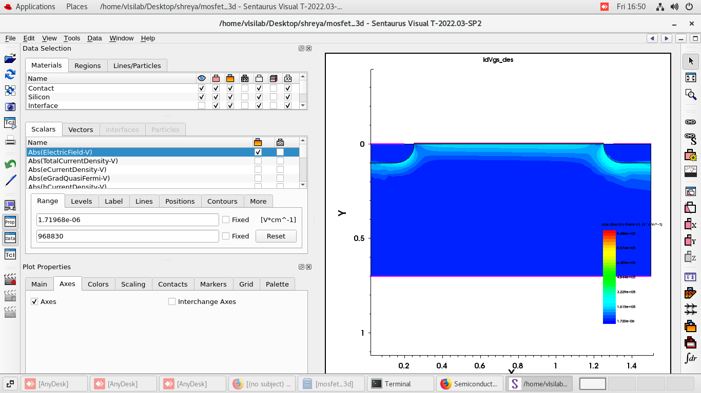
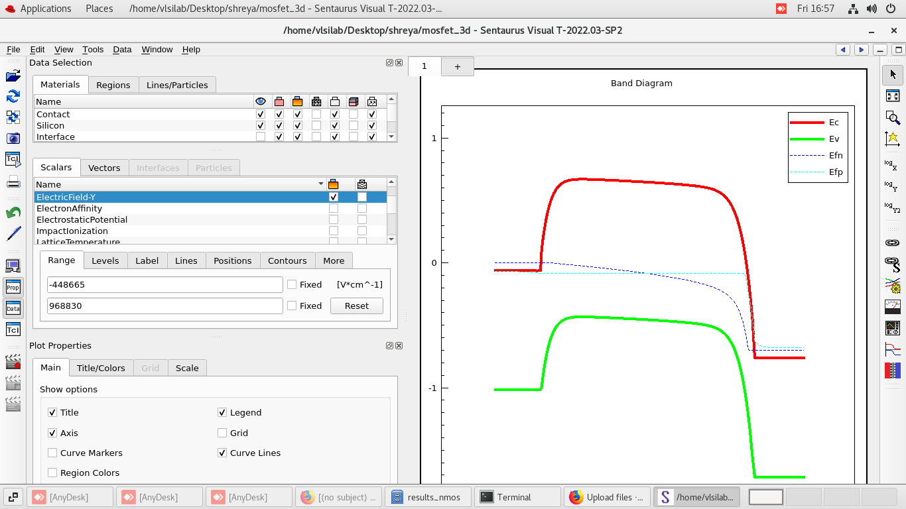
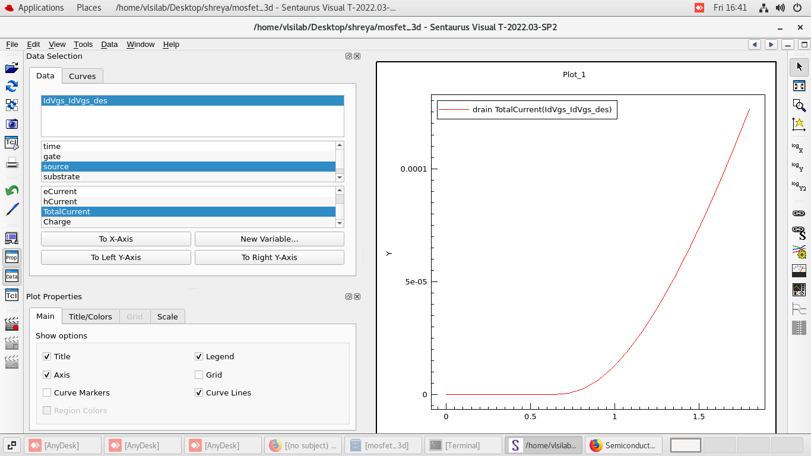

# Semiconductor-Device-Physics

This repository serves as a collection of experiments and learning exercises in semiconductor device modeling and TCAD-based analysis.

<b>2D NMOS</b>

### Description

This experiment demonstrates the simulation of a **2D NMOS transistor structure using Synopsys TCAD**. The device structure is created with defined source, drain, and channel regions along with a gate oxide layer and gate electrode.

### Objectives

* Construct a basic 2D NMOS device structure
* Apply appropriate doping profiles for source and drain regions
* Run device simulations to observe electrical characteristics
* Analyze results such as potential distribution and current–voltage behavior

### Files Included

* TCAD structure and simulation scripts
* Output data from the simulation
* Result visualizations generated from the simulation

### Mesh Generation

A mesh is generated over the device structure to discretize the semiconductor region for numerical simulation. Finer meshing is applied near critical regions such as the channel and gate oxide interface to improve simulation accuracy.

### Current Density Distribution

The current density plot shows how charge carriers flow through the device when a bias is applied. The highest current density is observed along the channel region between the source and drain.

### Electric Field Distribution

The electric field distribution in the 2D NMOS device is primarily determined by the applied bias conditions and the doping profile of the device.

* **High Electric Field near the Drain:**
  The strongest electric field  appears near the drain–channel junction. This occurs because the potential drops rapidly in this region when a drain voltage is applied, creating a steep potential gradient.

* **PN Junction Depletion Regions:**
  Electric fields are also present at the source–body and drain–body PN junctions due to the formation of depletion regions where mobile charge carriers are absent.

* **Lateral Electric Field Along the Channel:**
  When a gate voltage forms an inversion channel, the applied drain voltage generates a lateral electric field along the channel that drives electrons from the source to the drain.

* **Field Near the Oxide–Semiconductor Interface:**
  The gate voltage influences the electric field near the silicon–oxide interface, which plays a key role in controlling channel formation and carrier transport.

### Energy Band Diagram Analysis (Y-Cutline)

The energy band diagram extracted along the **Y-direction cutline** shows the band bending along the channel from the **Source (left)** to the **Drain (right)** in the NMOS device.

#### Region Analysis

* **Source Region (n⁺):**
  In the source region, the electron quasi-Fermi level (E_{fn}) lies very close to the conduction band (E_c), indicating a high concentration of electrons available for injection into the channel.

* **Channel Region (p-type substrate):**
  The central "hump" in the conduction band represents the **potential barrier of the p-type channel**. Electrons must overcome this barrier to travel from source to drain.
  The height of this barrier is controlled by the **gate voltage (V_G)**, which modulates the band bending and enables channel formation. We can see that the fermi level is closer to E_v

* **Drain Region (n⁺):**
  The sharp drop in the bands near the drain indicates a **positive drain bias (V_{DS} > 0)**. This creates a strong electric field that accelerates electrons from the channel into the drain.

### Transfer Characteristics (Id–Vgs)

The **drain current ((I_D)) vs gate-to-source voltage ((V_{GS}))** plot illustrates the transfer characteristics of the NMOS device. This curve shows how the drain current changes as the gate voltage controls the formation of the inversion channel.

#### Key Observations

* **Subthreshold Region:**
  At low (V_{GS}), the drain current is very small because the channel has not yet formed. Current flow is mainly due to weak inversion.

* **Threshold Voltage ((V_{th}))**:
  As (V_{GS}) increases and reaches the threshold voltage, a conductive channel forms at the silicon–oxide interface, allowing significant current to flow from source to drain.

* **Strong Inversion Region:**
  For (V_{GS} > V_{th}), the inversion layer strengthens and the drain current increases rapidly with increasing gate voltage.

### Notes

This experiment serves as a foundational step for understanding MOSFET device simulation and will be extended with more advanced structures in future experiments.

https://github.com/cybersonneteer/Semiconductor-Device-Physics/tree/main/2D%20DEVICES

